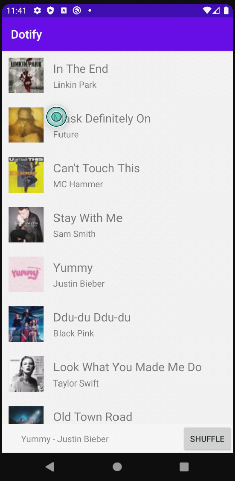

# Dotify by Sean Yang

This is a second version of a music player. The main part of the player is a list of musics.
A user can click on any music in the list and the mini player in the bottom will show
the current music playing. When a user clicks on the mini player, the screen will be directed
to a full player. User can go back to list by clicking on the back button below.
This version is different from the previous one in that this one uses fragments rather than multiple
activities
Unfortunately this version does not support user changes. 

## Screenshots

